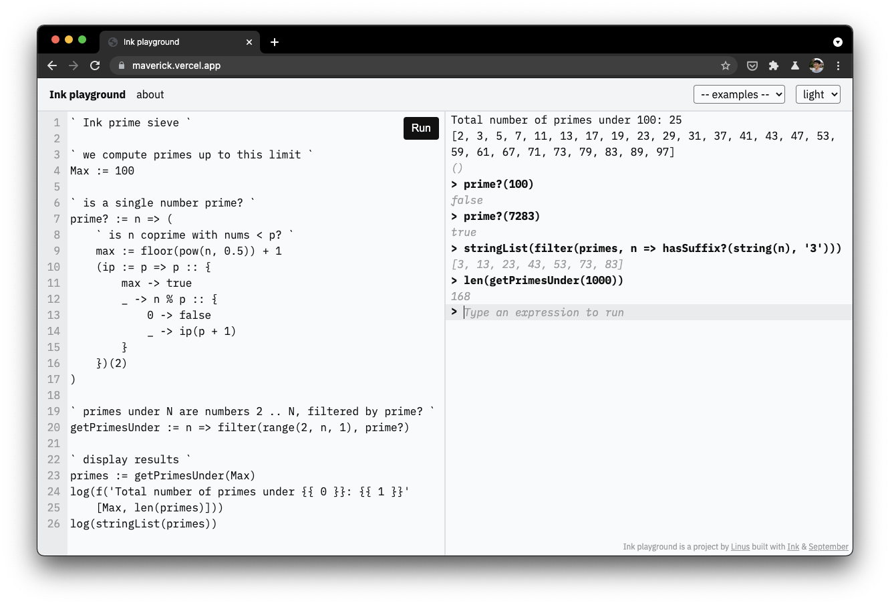

# Ink playground, _"Maverick"_ 🦅

**Maverick** is a simple web IDE and REPL for the [Ink programming language](https://dotink.co/), written in pure Ink and built on a self-hosted [September](https://github.com/thesephist/september) compiler toolchain that runs entirely in the browser. It compiles Ink code to JavaScript to run it locally without requiring a backend or a native execution environment, which is possible because the September compiler is used to compile the compiler itself to JavaScript bundled in the web app.

You can try the demo at **[maverick.vercel.app](https://maverick.vercle.app)** by running some included example programs.

## Architecture

Maverick's primary goal is to enable anyone to write and experiment with Ink programs without installing anything on their system. I had developed a version of the playground before that was backed by a sever-side evaluation service, but I didn't feel very secure publishing a remote code execution service to the open Internet, for obvious reasons.

Maverick gets around this problem by _compiling and running Ink programs entirely in the browser_. This is possible because September, the Ink-to-JavaScript compiler, is compiled to JavaScript using itself. September then runs in the browser, and can compile other Ink programs to JavaScript programs and run them immediately in the browser using JavaScript's `eval()`. This has the unfortunate side-effect of Ink programs being able to introspect and modify the surrounding web application, but this isn't too much of an issue, because if anything breaks, you can just reload the page!

Outside of the compiler, Maverick is a simple single-page web application built using [Torus](https://github.com/thesephist/torus).

### REPL environment

Currently, Ink's module system does not work within September-compiled JavaScript bundles. So instead, these standard libraries are globally available in the REPL environment:

- `std`
- `str`
- `quicksort`

For example, we can type in `sort!(map([1, 2, 3], n => n * n))` to the REPL and execute it without importing `std`.
## Development

Because Maverick depends significantly on the September compiler, the repository is designed to be cloned side-by-side to the [`thesephist/september](https://github.com/thesephist/september) repository. Maverick, during the build step, will reach inside the September repository next to it to compile it into JavaScript.

Maverick uses a Makefile for development and build tasks. Simply running `make` will re-compile all dependencies and the application, including the September compiler itself. it produces a static JavaScript bundle into `static/ink/bundle.js`. Other commands are as follows.

- `make watch`
- `make fmt` or `make f` formats all non-vendored source code, including tests.
- `make check` or `make t` runs all tests.
- There are several different build tasks, depending on what portion of the app you want to compile:
    - `make build-libs` compiles the common dependencies between September and Maverick into `ink/lib.js`
    - `make build-september` compiles the September compiler source from the directory `../september` into `ink/september.js`
    - `make build` compiles the Maverick application itself into the final bundle, assuming that the dependencies and September itself have been compiled.
    - `make watch` or `make w` watches Maverick's source code for changes and recompiles them when they are changed. This is useful for iterating during development, and depends on [entr](http://eradman.com/entrproject/).

Maverick is continuously deployed as a static site on Vercel, on every push to git branch `main`.
